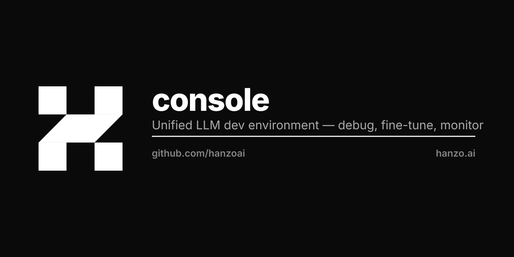

<p align="center"></p>

# Hanzo Cloud Console

Unified admin console for **Hanzo Cloud** and all Hanzo cloud products. Built on
[@hanzo/gui](https://gui.hanzo.ai) (cross-platform UI) over the unified `/v1`
backend (`hanzoai/cloud`). Dark theme, OIDC sign-in via Hanzo IAM.

Manages: **Providers · Models · Applications · Stores · Chat** — with an
extensible product-module registry so every cloud product can be added as a
module.

## Quick start

```bash
npm install
cp .env.example .env.local
# set NEXT_PUBLIC_IAM_CLIENT_ID for live sign-in; defaults point at production.
npm run dev          # http://localhost:4000
```

## Scripts

| Script | What |
| --- | --- |
| `npm run dev` | Dev server on :4000 |
| `npm run build` | Production build (type-checks; Gui CSS injected at runtime) |
| `npm run start` | Serve the production build |
| `npm run typecheck` | `tsc --noEmit` (strict) |

## Configuration

All config is `NEXT_PUBLIC_*` (browser app, cookie auth). See `.env.example`.

| Var | Default | Meaning |
| --- | --- | --- |
| `NEXT_PUBLIC_CLOUD_URL` | same origin, else `https://api.hanzo.ai` | The ONE Hanzo API endpoint (unified `/v1` backend). Never a per-service API host. |
| `NEXT_PUBLIC_IAM_URL` | `https://iam.hanzo.ai` | Hanzo IAM OIDC authority |
| `NEXT_PUBLIC_IAM_APP_NAME` | `hanzo-console` | IAM application (`<org>-<app>`) |
| `NEXT_PUBLIC_IAM_ORG_NAME` | `hanzo` | IAM organization |
| `NEXT_PUBLIC_IAM_CLIENT_ID` | — | OAuth client id |

## Architecture

See [LLM.md](./LLM.md) for the full design (base choice, /v1 client, auth flow,
the product-module registry, and the Providers surface). Endpoint reference in
[docs/endpoints.md](./docs/endpoints.md).

## License

BSD-3-Clause. Copyright (c) 2026-present, Hanzo AI, Inc.
